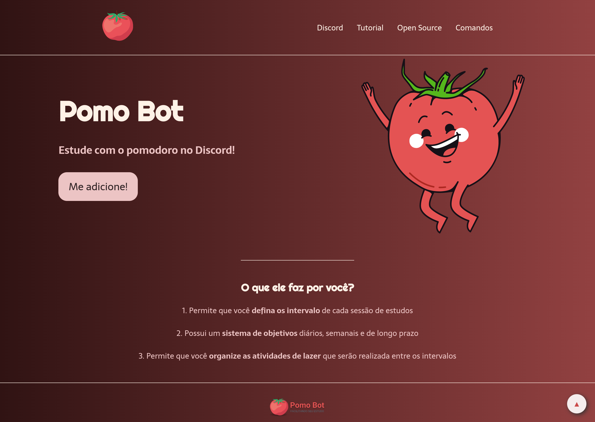

<h1 align="center"><a href="#" alt="site do pomobot"> POMO BOT 🍅 </a></h1>

 <h4 align="center"> 🟢 Status do projeto:  Concluído ✔️   </h4>  

## 💻 Descrição do projeto 
 O Pomo Bot é uma landing page criada como projeto final do curso Code Together oferecido pela Universidade Federal da Paraíba. 
 
O projeto é responsivo, conta com um menu mobile e com um botão de voltar ao topo. 
 
  

## 🚀 Como acessar o projeto:

Para acessar o link do projeto [clique aqui](https://anafts.github.io/PomoBot/)

 

## 🛠️ Tecnologias utilizadas:  

 

## 📚 Aprendizagem:

O pomo bot foi a primeira landing page que eu desenvolvi, com o projeto eu consegui aprender
- FlexBox
- Botão "back to top"
- Menu mobile
- Responsividade

